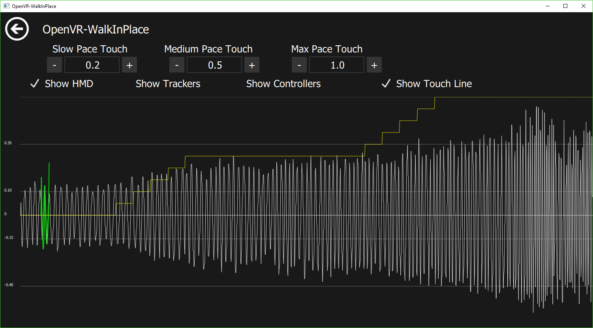
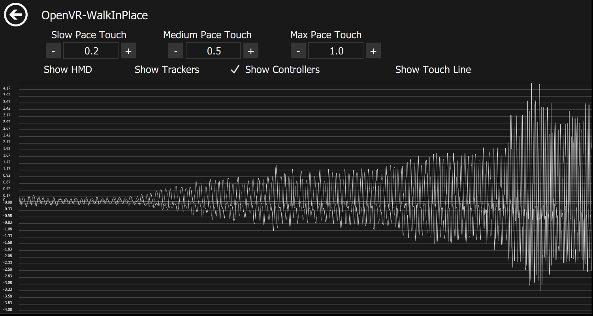

    

# OpenVR-WalkInPlace (now supports mlpack data models)

An OpenVR client and driver that tracks real-time device tracking data and applies virtual movement using linear analysis of mlpack data models with armadillo libraries.

As long as the real-time tracking sample is accurately represented in the recorded model, virtual input will be applied. Scale of input can be customized.

## A history

https://sites.google.com/view/openvr-walkinplace/home

# Features

- Movement Data Model recording, of HMD, tracker and controller devices
- supports Walk In Place Locomotion
- supports Arm Swinging Locomotion
- Or any other HMD,tracker movement pattern that can be recorded and matched in a data model

# Upcoming

- HMD Relative Direction Override to any tracked device Relative Direction
- Linux support
 
## Installer

Download the newest installer from the [release section](https://github.com/pottedmeat7/OpenVR-WalkInPlace/releases) and then execute it. Don't forget to exit SteamVR before installing/de-installing.

# Documentation

## Configuration Examples


## GIF Step Examples
Walking Example: 


Jogging Example: 


Running Example: 


Direction Control Example: 


*This is an example of the graph while walking in place*

## Data Models
You can record a data model of your HMD, tracker and controller movement rates to use to match the similar movement in real-time.
You can Create, Apply, and Delete the data models. The current applied Data Model, will the one saved into a profile if you create one. You can also choose any pre-recorded data models without a profile as well.
If you name a data model with the name "default" it will be the initially loaded data model once you start SteamVR.

## Data Model Recording
Follow the on screen popups instructions when recording a new data model. The recording process is from slowest to fastest movement of all devices. There will be 5 steps in the following order, Slowest Pace (5 seconds), Slow Scaling up to Medium (5 Second), Medium Paced (5 Seconds), Medium Scaling up to Fast (5 Seconds), and Fastest Pace. 

As you record the touch values are recorded in the following order Slow (0 touch value), Slow to medium (0-0.5 touch value), Medium (0.5 touch value), Medium to fast (0.5-1.0 touch value), and Fast (1.0 touch value)

Mostly it will be your controller values that are used to determine where in the model to pick the corresponding touch value from.
The HMD and trackers mainly determine if you are moving at all according to the model.

If you find that you move to quickly to soon, try re-recording a model with more significant arm swinging.

### Apply Data Model
Make sure to "apply" the data model before Enabling WIP or trying to view the data model as well.

## Show Data Model Page


*This shows the HMD model, the model touch values, and the current real-time sample (in green)*


*This is an example data model of the controllers values from slow pace to fast pace*

### Show HMD, Show Trackers, Show Controller, Show Touch Line
These show the models of each device. The Touch Line is the values inserted from 0-1 of the progress during the recording. 
The touch-line will be scaled to be between the values in the "Touch Pace Options". Ie. From Min-Max.

### Touch Pace Options
These values control the degree of movement applied in game.
Some games will use the touchpad axis differntly, for slow games sometimes there is only 1 degree of movment.
Some games use the entire axis from the center, 0, to 1

If you find the walking with just the HMD is too sensitive you can set the "Walk Touch" to 0 this will require your HMD and arms to swing in order to trigger a step via triggering the "mid" or "max" touch value.

## Other Options

## Enable WIP
This checkbox either enables or disables all detection and virtual input

### HMD Type
Choose which HMD your using

### Input Type
There are a few different methods of inputs used by games
- The standard "Touchpad" locomotion games, that use from 0-1 on the touchpad (or joystick) for forward movement speed, often these games also have a "click to sprint" function. 
- Some games use touchpad locomotion except you have to press and hold the touchpad while moving your finger from 0-1 use the option "Touchpad (pressed)" for these games
- Anything else such as Teleport games, using "click to sprint" with the minimum touch value set to 1.0 will generate a click for any valid movement match

### OVRWIP Controller
All touchpad input goes to the OVRWIP Custom Controller you can rebind this input to other controllers and buttons using the SteamVR Input Bindings.

### buttons to disable/enable WIP
These options can be used to disable/enable virtual movement when your holding or not holding the button selected.

## Enable / Disable Device page

### Track HMD? 
This will enable/disable the tracking and analysis of the real-time HMD movement. If disabled it will ignore the HMD data in the current data model and will only utilize the thresholds of the tracker movement. 

### Track HMD Rotation?
This is a enhanced check to track if the rotational velocity values of HMD YAW and PITCH are within the maximum recorded values of the current data model.

### controller selection for hand(s)
If you have more then 1 controllers, you can select another combination of 1-2 controllers to be used as the 1-2 tracked hand(s).

### controller selection for feet (untesed)
If you have more then 1 controllers, you can select another combination of 1-2 controllers to be used as the 1-2 tracked feet.

### tracker selection for hand(s) (untesed)
If you have more then 1 trackers, you can select another combination of 1-2 trackers to be used as the 1-2 tracked hand(s).

### tracker selection for feet
If you have more then 1 trackers, you can select another combination of 1-2 trackers to be used as the 1-2 tracked feet.

[//]: # ### Direction devices - work in progress
[//]: # This will allow customization of direction of movement using any of the devices. Just as many games use the controller as the direction device, although some use the HMD direction. 

### Profiles
If you like your current settings for a game and want to save them you can click "New Profile" it will take the current settings and save them with the profile name of your choice. 
If you want to update a profile with new settings you need to select the profile and delete it and re-create a "New Profile".

If you name a profile with the name "default" it will be the initially loaded profile once you start SteamVR. If you dont want to automatically enable walk in place locomotion on startup save the default profile with "enableWIP" unchecked.


### Other settings
You can modify the size and length of the real-time samples to shorten or lengthen the needed data to either start or stop movement
you have to edit the ini file found at `C:\Users\<USERNAME>\AppData\Roaming\pottedmeat7\OpenVRWalkInPlace.ini` and add any of the following variables  
*Before changing these try to understand how changing these affects the matching decision for starting and stopping movement
A quick summary is the start sample is used before any movement has been applied, ie. the first step
The ongoing sample size is for when your movement has fit the model previously the following samples require less data
The max sample size is just the limit before data points are removed from the sample*
```
maxHMDSampleSize=16
startHMDSampleSize=12
ongoingHMDSampleSize=4
maxTRKRSampleSize=19
startTRKRSampleSize=14
ongoingTRKRSampleSize=8
maxCNTRLSampleSize=12
ongoingCNTRLSampleSize=10
```
## Graph Page
The graph page will show you realtime values from the HMD, controllers and trackers.
If you have WIP enabled the graph page will display vertical lines yellow for walk detection, orange for jog detection and red for run detection.

## Any Issues Check out the Logs
Overlay UI Log here `C:\Users\<USERNAME>\AppData\Roaming\pottedmeat7\OpenVRWalkInPlace\VRWalkInPlace.log`
Driver Log here `C:\Program Files (x86)\Steam\steamapps\common\SteamVR\drivers\00vrwalkinplace\bin\win64\driver_vrwalkinplace.log`


## Setting up To Re-Build the project from Source
*You do not need this if you just want to use the WIP overlay*

### Boost
- WINDOWS
	1. Goto https://sourceforge.net/projects/boost/files/boost-binaries/1.65.1/
	2. Download Boost 1.65 Binaries (boost_1_65_1-msvc-14.1-64.exe)
	3. Install Boost into `OpenVR-WalkInPlace/third-party/boost_1_65_1`
- LINUX
	1. Go to https://sourceforge.net/projects/boost/files/boost/1.65.1/
	2. Download boost_1_65_1.tar.gz
	3. Extract the files into `OpenVR-WalkInPlace/third-party/boost_1_65_1`
  
### Qt
1. Goto https://download.qt.io/official_releases/qt/5.9/5.9.0/
2. Download Qt 5.9.0 (Either windows .exe or linux .run file)
3. Run the Qt installer (I installed it to `c:\Qt` or `/home/<user>/` on linux)

### mlpack, openblas and armadillo
- WINDOWS
	1. https://www.mlpack.org/doc/mlpack-3.0.4/doxygen/build_windows.html
- LINUX
	1. https://www.mlpack.org/doc/mlpack-3.0.4/doxygen/build.html

## Building
- WINDOWS
	Build *'VRWalkInPlace.sln'* in Visual Studio 2017
- LINUX	
	Build the OpenVR-WalkInPlaceOverlay.pro project with Qt Creator 
	from a shell run
	`./build.sh`
	go to https://github.com/probonopd/linuxdeployqt/releases and download the AppImage
	then run
	`cd <OpenVR-WalkInPlace path>/client_overlay/bin/x64/
	<linuxdeployqt path>/linuxdeployqt-5-x86_64.AppImage OpenVR-WalkInPlaceOverlay -qmldir=res/qml/ -no-translations -bundle-non-qt-libs -appimage -verbose=2`

### Building installer
1. go to https://sourceforge.net/projects/nsis/files/NSIS%202/2.33/
2. download and run the nsis-2.33-setup.exe
3. go to `OpenVR-WalkInPlace/installer`
4. right click the `installer.nsi` file and `Compile NSIS Script`
5. the installer exe will be built into the same directory

## Uninstall
1. Run "C:\Program Files\OpenVR-WalkInPlace\Uninstall.exe" will remove everything

# Known Bugs

- The shared-memory message queue is prone to deadlock the driver when the client crashes or is exited ungracefully.

# License

This software is released under GPL 3.0.
