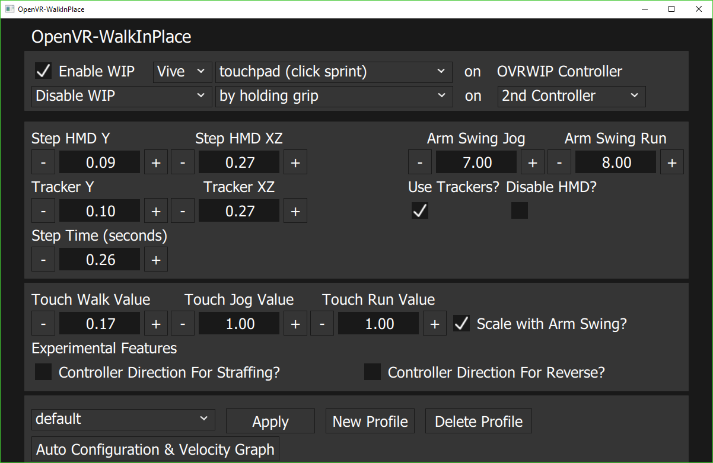
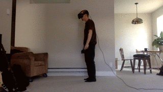
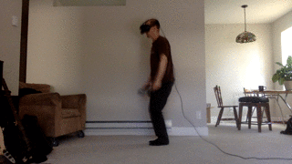
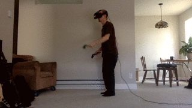
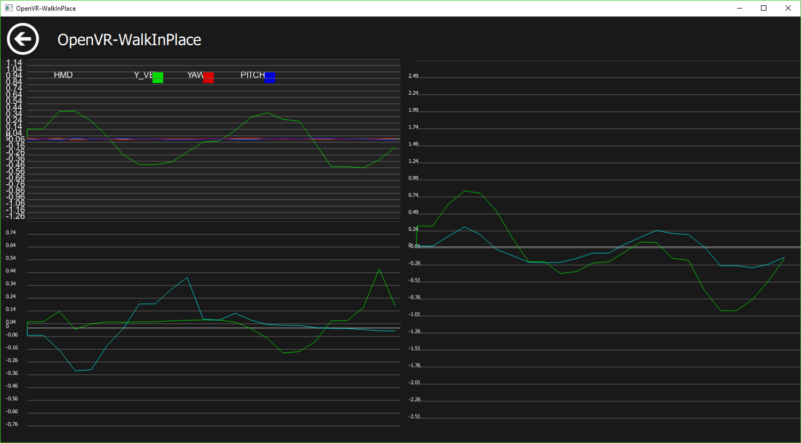

    

# OpenVR-WalkInPlace

An OpenVR driver that applies virtual movement using a pedometer

The OpenVR driver hooks into the lighthouse driver and tracks movement of the HMD and Controllers. It then applies movement into the virtual envrionment.

# Current Games that Work Best with OpenVR-WalkInPlace

- Skyrim VR
- Fallout 4 VR
- Rec Room
- Arizona Sunshine
- Onward
- VR-Chat
- DOOM VFR (with Keyboard (WASD))
- Any other games with Keyboard or Touchpad locomotion controls

Other games may not have touchpad movement options however this driver will 
also activate teleport if you'd like.

# Features

- Change Step Thresholds for Walk / Jog / Run in Place to fit different games
- Tracker support (for feet)
- Configuration for "Arm Swinging" Locomotion
- Change speed of movement applied in game 
- Profiles for different games
- graph of velocity values for step configuration

# Upcoming

- Auto Configure
- Options for emulating other input methods
- Fixes for teleport games

## Installer

Download the newest installer from the [release section](https://github.com/pottedmeat7/OpenVR-WalkInPlace/releases) and then execute it. Don't forget to exit SteamVR before installing/de-installing.

If you also use OpenVR-InputEmulator you can use the 'OpenVR-WalkInPlace-OVRIE-driver.exe' installer.

# Documentation

## Configuration Examples

*These are settings which work for many games

## GIF Step Examples
Walking Example: 

Jogging Example: 

Running Example: 

Direction Control Example: 

*This is what the graph should look like when walking in place

## Watch the Selected Controller touchpad to See Successful Virtual Input
When a step is detected touchpad input will be applied to the selected controller. In the SteamVR Overlay this input will be visualized with a small grey dot on the virtual touchpad of the selected controller. 

## Any Issues Check out the Logs
Overlay UI Log here `C:\Users\<USERNAME>\AppData\Roaming\pottedmeat7\OpenVRWalkInPlace\VRWalkInPlace.log`

Driver Log here `C:\Program Files (x86)\Steam\steamapps\common\SteamVR\drivers\00vrwalkinplace\bin\win64\driver_vrwalkinplace.log`

### WalkInPlace Overlay
Just "Enable WIP" in the UI.

Enable the "analog" locomotion in the games settings this is the input method that uses the touch-pad
Then you simply walk in place to virutally walk in VR.

### HMD Type
Choose which HMD your using

### Game Type
These are the input type for the game

### Controller selection (which controller is used for virtual input)
Some games only use one controller for locomotion while the other touchpad is used for different functions.
This menu allows you to select which controller should be used for virtual input.
The 1st and 2nd option will just switch between two controllers without identification.
The selected controller will highlight green for 10 seconds

### HMD Thresholds
The Y value is the Up and Down movement of your head to trigger a step, in order to trigger the real time HMD values have to be greater than the Y threshold.

The XZ value is the Side to Side movement that will disable triggering a step (if over the threshold), in order to trigger a step the HMD values have to be less than the XZ threshold.

The HMD Y values have to be greater then the HMD XZ values a in order to take a step as well as both Y and XZ meet the threshold.

### Tracker Thresholds
These values are functionality the same as the HMD values except from a tracker device. 

### Use Trackers?
Enables/Disable trackers. This will use both the HMD thresholds and tracker thresholds in order to trigger a step.

### Disable HMD?
This will disable the tracking of the HMD movement, and will only utilize the thresholds of the tracker movement. 
You must have both "Use Trackers?" Checked as well as "Disable HMD?" checked. 

### Arm Swing Jog / Arm Swing Run
These values are for the controller Up and Down movement of the arms. 
The real time Controller values have to be greater then these values in order to Jog / Run.

### Button to enable WIP
These options can be used to disable virtual movement when your not holding the button selected.

### Disable WIP when held?
This will change the "Button to enable WIP" behavior instead of allowing virtual movement when the button is held, it will only allow virtual movement when the button is not held and visa versa.

### Controller for button
This is the controller used for the "Button to enable WIP" 

### Step Time
This is how long each "step" lasts. If 1 step is detected it will last this amount of time in seconds. As you repeat steps this time is reset for every step detected. 

### Touch Options
These values control the degree of movement applied in game.
Some games will use the touchpad axis differntly, for slow games sometimes there is only 1 degree of movment.
Some games use the entire axis from the center, 0, to 1

If you find the walking with just the HMD is too sensitive you can set the "Walk Touch" to 0 this will require your HMD and arms to swing in order to trigger a step via triggering the "jog" or "run" touch value with the "arm swing" thresholds above.

### Profiles
If you like your current settings for a game and want to save them you can click "New Profile" it will take the current settings and save them with the profile name of your choice. 

After re-opening SteamVR you can reload your saved profiles by first clicking "Load Profiles" then selecting the profile you want from the drop down menu, and click "Apply".

If you want to update a profile with new settings you need to select the profile and delete it and re-create a "New Profile".

If you name a profile with the name "default" it will be the initially loaded profile once you "load profiles".

## Graph Page

The graph page will show you realtime values from the HMD, controllers and trackers.
If you have WIP enabled the graph page will display vertical lines yellow for walk detection, orange for jog detection and red for run detection.

## Setting up To Re-Build the project from Source
*You do not need this if you just want to use the WIP overlay*

### Boost
1. Goto https://sourceforge.net/projects/boost/files/boost-binaries/1.65.1/
2. Download Boost 1.65 Binaries (boost_1_65_1-msvc-14.1-64.exe)
3. Install Boost into `OpenVR-WalkInPlace/third-party/boost_1_65_1`
  
### Qt
1. Goto https://download.qt.io/official_releases/qt/5.9/5.9.0/
2. Download Qt 5.9.0
3. Run the Qt installer (I installed it to "c:\Qt")

NOTE: Adjust the path the `msvc2017_64` folder in Qt to match your installation

Then run the `OpenVR-WalkInPlace\client_overlay\bin\windeployqt.bat` if your system doesn't find the exe update the batch to the absolute path
in `{QT_INSTLATION_PATH}\5.9\msvc2017_64\bin\windeployqt.exe`

## Building
1. Open *'VRWalkInPlace.sln'* in Visual Studio 2017.
2. Build Solution

### Building installer
1. go to https://sourceforge.net/projects/nsis/files/NSIS%202/2.33/
2. download and run the nsis-2.33-setup.exe
3. go to `OpenVR-WalkInPlace/installer`
4. right click the `installer.nsi` file and `Compile NSIS Script`
5. the installer exe will be built into the same directory

## Building
1. Open *'VRWalkInPlace.sln'* in Visual Studio 2017.
2. Build Solution

## Uninstall
1. Run "C:\Program Files\OpenVR-WalkInPlace\Uninstall.exe" will remove the application from the registry. 
2. Delete the folder "C:\Program Files\OpenVR-WalkInPlace"
3. Delete the folder "C:\Program Files (x86)\Steam\steamapps\common\SteamVR\drivers\00vrwalkinplace" 

# Known Bugs

- The shared-memory message queue is prone to deadlock the driver when the client crashes or is exited ungracefully.

# License

This software is released under GPL 3.0.
