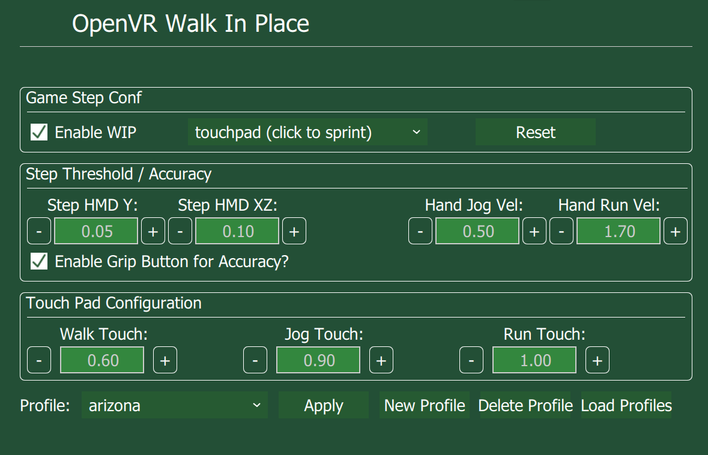

    

# OpenVR-WalkInPlace

An OpenVR driver that applies virtual movement using a pedometer

The OpenVR driver hooks into the HTC Vive lighthouse driver and tracks movement of the HMD and Vive Controllers. It then applies movement into the virtual envrionment.

# Current Games that Work Best with OpenVR-WalkInPlace

- Fallout VR
- Arizona Sunshine
- Onward
- Gorn
- DOOM VFR (with Keyboard (WASD))
- Any other games with Keyboard or Touchpad locomotion controls

Other games may not have touchpad movement options however this driver will 
also activate teleport if youd like.


# Features

- Change Step Thresholds for Walk / Jog / Run in Place to fit different games
- Configuration for "Arm Swinging" Locomotion
- Change speed of movement applied in game 
- Profiles for different games

# Upcoming

- Tracker support (for feet)
- Options for emulating other input methods
- Jumping support
- Fixes for teleport games

## Installer

Download the newest installer from the [release section](https://github.com/pottedmeat7/OpenVR-WalkInPlace/releases) and then execute it. Don't forget to exit SteamVR before installing/de-installing.

# Documentation

## Configuration and Accuracy Setup and Troubleshooting

### Issue: Not taking steps
Solution 1: I found that when jogging / running there is still quite alot of XZ movement so if your trying to jog / run and its not virtually moving, then try to increase the XZ value which allows for more XZ movement.

Solution 2: Also I found its hard to have the Y value be larger then the threshold as well as the XZ value if you are looking down to far.
So keeping the pitch of your HMD looking forward is the best way to trigger a "step".

### Issue: Taking Steps when you dont want to
Solution 1: Disable "Walk Touch" and use the HMD values as well as Hand values for any movement. 
To do this set the "Walk Touch" value to 0 and lower the "Hand Jog" value (something like 0.25).
This will create more of a system where you have to move your arms as well as your HMD to take a step. Limiting false steps.

Solution 2: Use one of the Accuracy buttons, you wont move while holding that button.

Solution 3: You can increase the Y value, lower the XZ value (be careful its a delicate balance) It may cause taking a step to be harder.
Also limiting the HMD pitch can ensure you only takes steps when looking forward.



### WalkInPlace Overlay
Just "Enable WIP" in the UI.

Enable the "analog" locomotion in the games settings this is the input method that uses touching the touch-pad (not clicking)
Then you simply walk in place to emulate walking in the VR world.

### Game Type
These options are for different combinations of controls some games use the touch-pad for movement and then a click to sprint, some use the click to engage teleport. If you dont want to trigger teleport use the second option.

### Controller selection (which controller is used for virtual input)
Some games only use one controller for locomotion while the other touchpad is used for different functions.
This menu allows you to select which controller should be used for virtual input.
The 1st and 2nd option will just switch between two controllers without identification.
There is no distinction just switch until its the right one. In some games you can just use the "both" option

### HMD Thresholds
The Y value is the Up and Down movement of your head to trigger a step, in order to trigger the real time HMD values have to be greater than the Y threshold.

The XZ value is the Side to Side movement to trigger a step, in order to trigger a step the real time HMD values have to be less than the XZ threshold.

### Hand Jog / Run
These values are for the magnitude of movement (X, Y and Z movement) of the arms. 
The real time Controller values have to be greater then these values in order to Jog / Run.

### Button for Accuracy
These options can be used to disable virtual movement when your not holding the button selected.

### HMD Pitch Degree
These values are the amount of pitch, in degrees, your HMD can have in order to take a step.
ie. You have to be looking mostly forward in order to step.

### Touch Options
These values control the degree of movement applied in game.
Some games will use the touchpad axis differntly, for slow games sometimes there is only 1 degree of movment.
Some games use the entire axis from the center, 0, to 1

If you find the walking with just the HMD is too sensitive you can set the "Walk Touch" to 0 this will require you HMD and arms to move in order to trigger a step.

### Profiles
If you like your current settings for a game and want to save them you can click "New Profile" it will take the current settings and save them with the profile name of your choice. 

After re-opening SteamVR you can reload your saved profiles by first clicking "Load Profiles" then selecting the profile you want from the drop down menu, and click "Apply".

If you want to update a profile with new settings you need to select the profile and delete it and re-create a "New Profile".

If you name a profile with the name "default" it will be the initially loaded profile once SteamVR is started.

### Arm Swinging 
To achieve more of an Arm Swinging only method you can set the "Walk Touch" value to 0
This will disable the walking mode and movement will only be applied if you are jogging / running.
You then can lower the HMD Y value very low and your HMD will only need to move slightly, but it will natrually move a bit.

## Initial Setup
### Boost
1. Goto https://sourceforge.net/projects/boost/files/boost-binaries/1.63.0/
1. Download Boost 1.63 Binaries (boost_1_63_0-msvc-14.0-64.exe)
1. Install Boost into `OpenVR-WalkInPlace/third-party/boost_1_63_0`
  
### Qt
1. Goto https://download.qt.io/official_releases/qt/5.7/5.7.0/
1. Download Qt 5.7.0
1. Run the Qt installer (I installed it to "c:\Qt")
1. Goto `OpenVR-WalkInPlace\client_overlay`
1. Create `client_overlay.vcxproj.user` and paste the following into it:

```
<?xml version="1.0" encoding="utf-8"?>
<Project ToolsVersion="14.0" xmlns="http://schemas.microsoft.com/developer/msbuild/2003">
  <PropertyGroup>
    <QTDIR>C:\Qt\5.7\msvc2015_64</QTDIR>
  </PropertyGroup>
</Project>
```

NOTE: Adjust the path the `msvc2015_64` folder in Qt to match your installation

Then run the `windeployqt.bat` if your system doesn't find the exe update the batch to the absolute path
in `{QT_INSTLATION_PATH}\5.7\msvc2015_64\bin\windeployqt.exe`

## Building
1. Open *'VRWalkInPlace.sln'* in Visual Studio 2015.
2. Build Solution


# Known Bugs

- The shared-memory message queue is prone to deadlock the driver when the client crashes or is exited ungracefully.

# License

This software is released under GPL 3.0.
