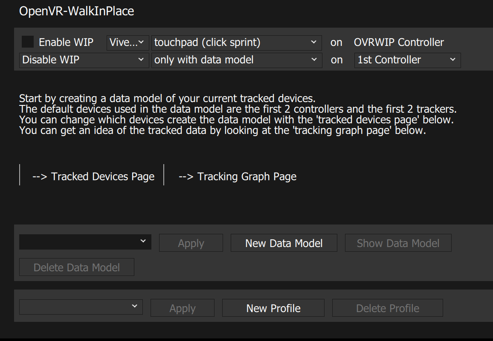
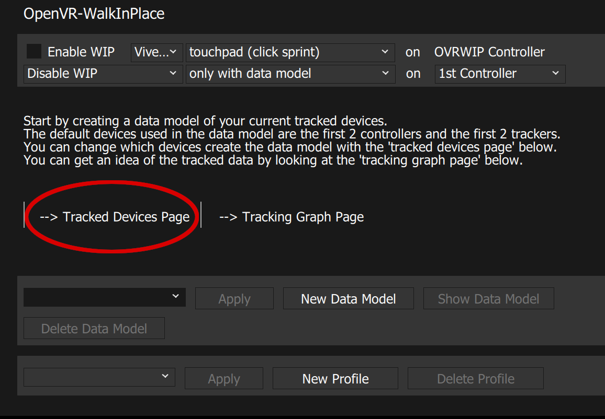
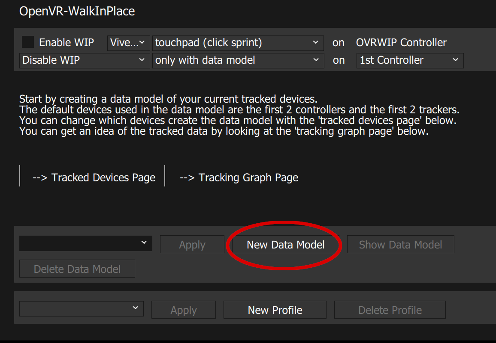
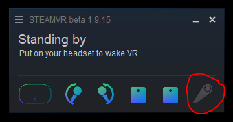

Steps to create setup OpenVR-WalkInPlace
*initial screen


*click on 'Tracked Devices Page'


*Select your preferred devices used to match movement model


*return to initial page and click on 'New Data Model'


*enter a name for your data model
*then proceed to follow the instructions:
```
The data model creation process takes ~25 seconds 5 seconds for each phase.
The process starts with slowest to increasing to medium to medium to increasing to fast to fastest.
Do not stop moving during this process.
If you do it will be recorded and used as a valid movement model.
You can always try it, view it, and recreate the model until you have what you'd like.
```


###There will be popup messages with a countdown when each phase will occur

*Here is an example alert going from step jogging tracking increasing to running tracking, (There is a full jogging and running stage, this is a stage that tracks any pace between the two)


###Once you have completed all stages of the data model it will automatically return to the initial page
### You then select your preferred data model from the dropdown
### and Click 'apply' and 'Enable WIP'


### Once you check 'Enable WIP' the 'ovrwip_controller' virtual controller will be created 
*You will see an additional controller added in SteamVR like this


### You can will get virtual input based on your data model 
### Then you can create SteamVR input bindings described here
https://github.com/pottedmeat7/OpenVR-WalkInPlace/tree/master/docs/screenshots/steamvr_bindings/
